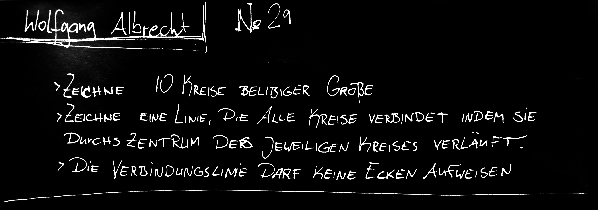
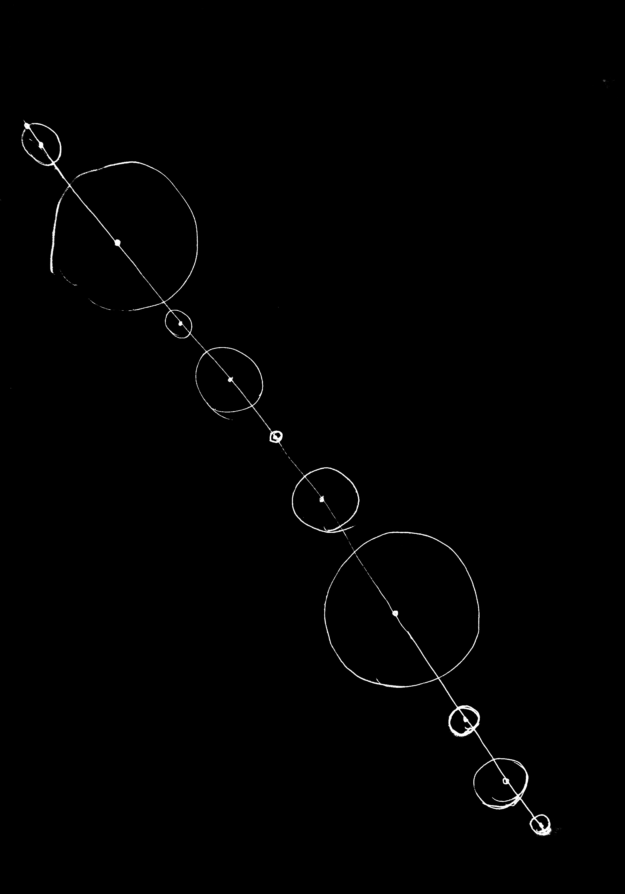
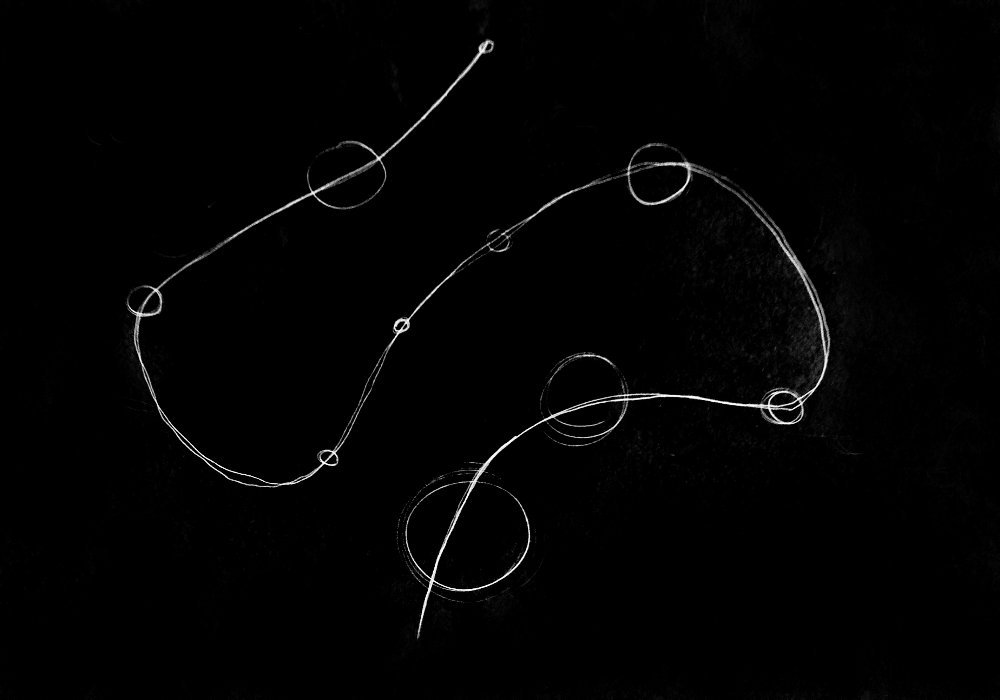
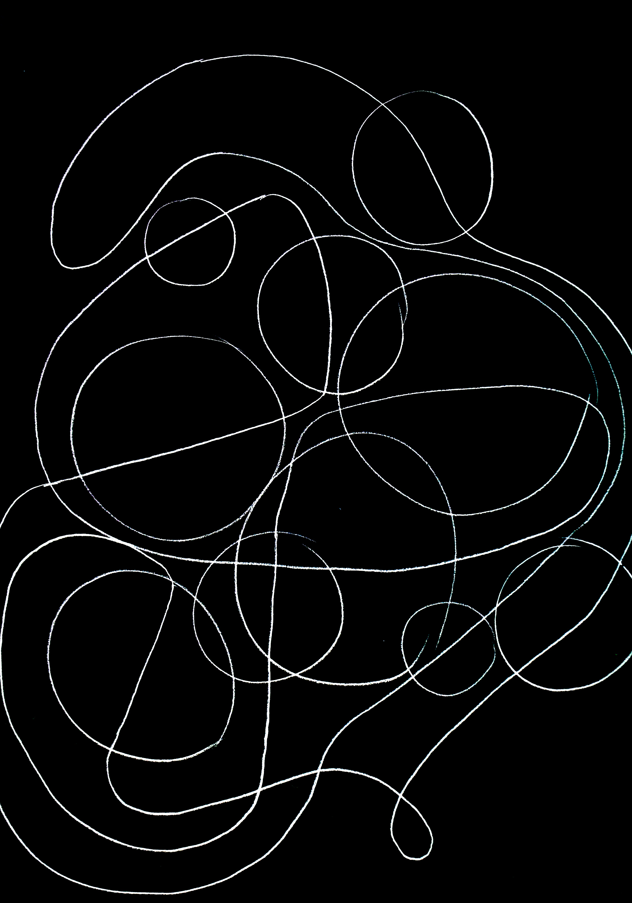

### The Mission

================

The four week project was all about working on algorithms. It was separated in three parts.

- the algorithm for humans to execute
- the traslation in material
- the translation in digital

We started off to develop an analog algorithm an try running it on at least ten person. The point was to find out how to deliver explecit tasks  to get a certain result. We ran our program for humans and tryed to improve it to make a step in direction of generative creation.
Coming from there we developed the tasks and were asked to improve the algorithm using other materialsor formats in genaral.  
Always developing the same algorithm, the last task of the project was to transfer the generative process to the computer. 
-----------------------------------
### The first algorithm

My first algorithm was very simple. The executing person had to draw a couple of circles and connect the middel points with only one line. That line must not contain any angle.

The interesting point of the results was, that all the people found very diffrent solutions for the tasks. And at this point you could tell already that there is a huge potential in creating through algerithms. The fact that the humans are executing the "program" in combination with their own intelligence was very interesting.

---------------------------------
The next step was to develop the algorithm in a way, that all the solutions look the same. Or at least, that the instructions were clear an unambiguous. 

-------------------------------

### The traslation in material

-------------------------------

### The translation in digital

-------------------------------
