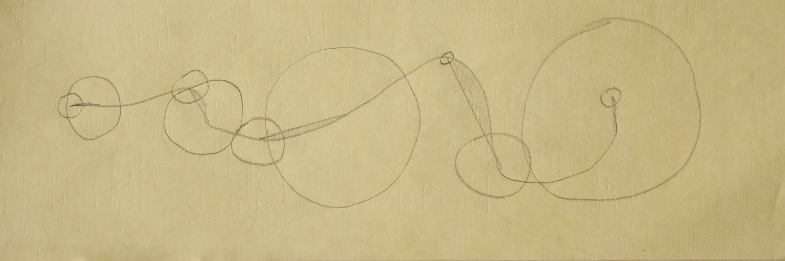

### The Mission

================

The four week project was all about working on algorithms. It was separated in three parts.

- the algorithm for humans to execute
- the traslation in material
- the translation in digital

We started off to develop an analog algorithm an try running it on at least ten person. The point was to find out how to deliver explecit tasks  to get a certain result. We ran our program for humans and tryed to improve it to make a step in direction of generative creation.
Coming from there we developed the tasks and were asked to improve the algorithm using other materialsor formats in genaral.  
Always working on the same algorthm the last task of the project was to transfer the generative process to the computer. 

### The first algorithm

-------------------------------

### The traslation in material

-------------------------------

### The translation in digital

-------------------------------
