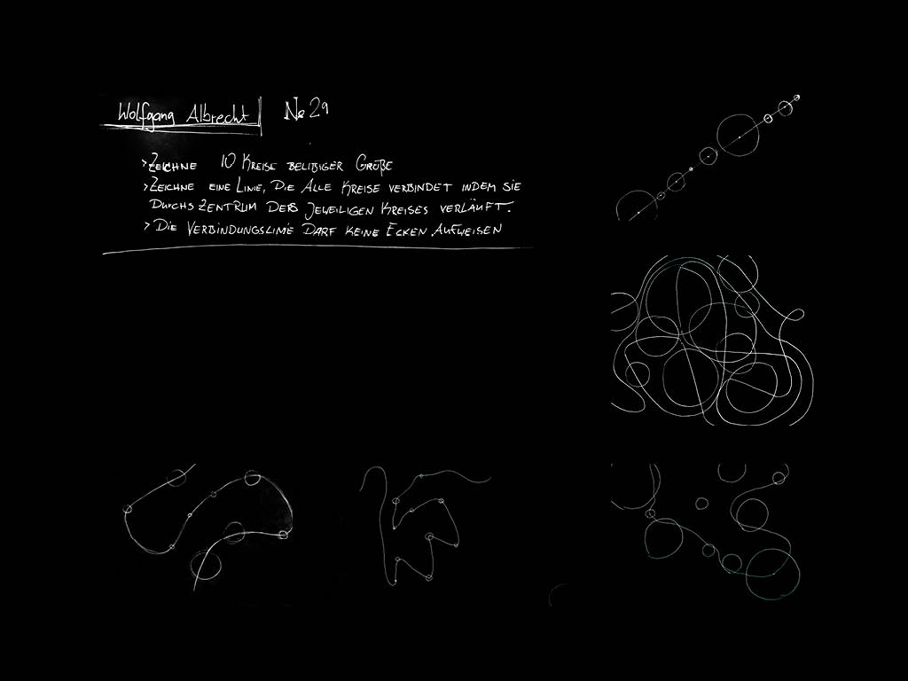
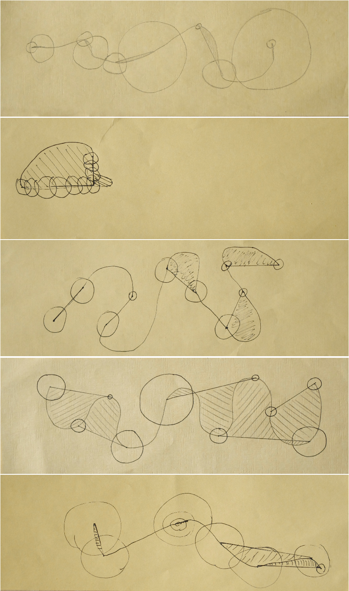
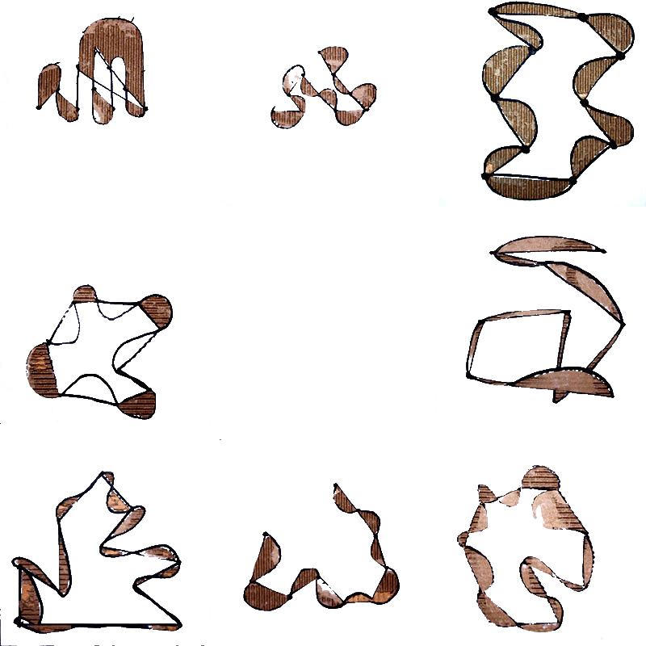
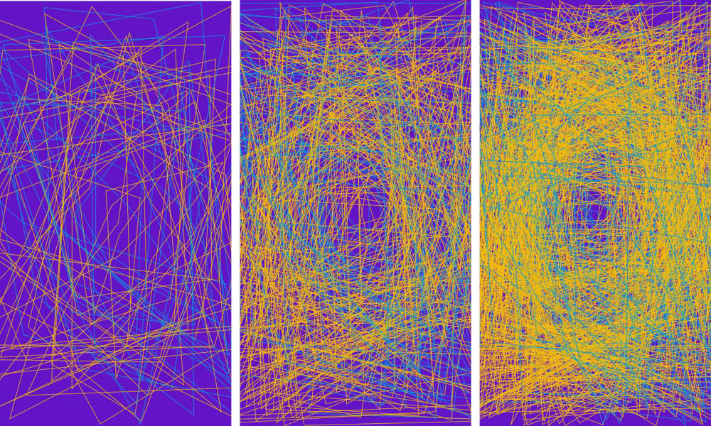
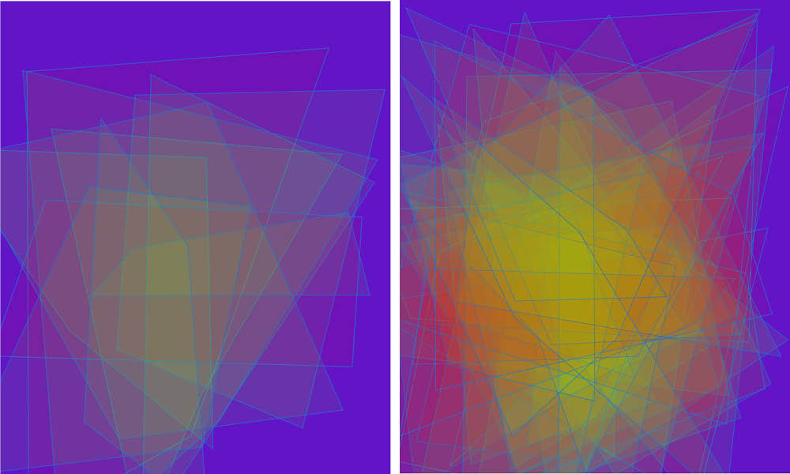
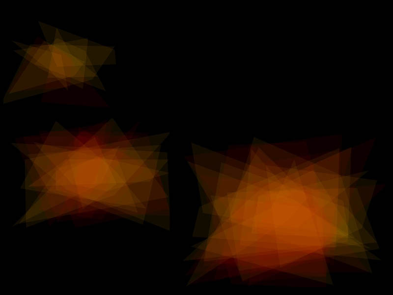
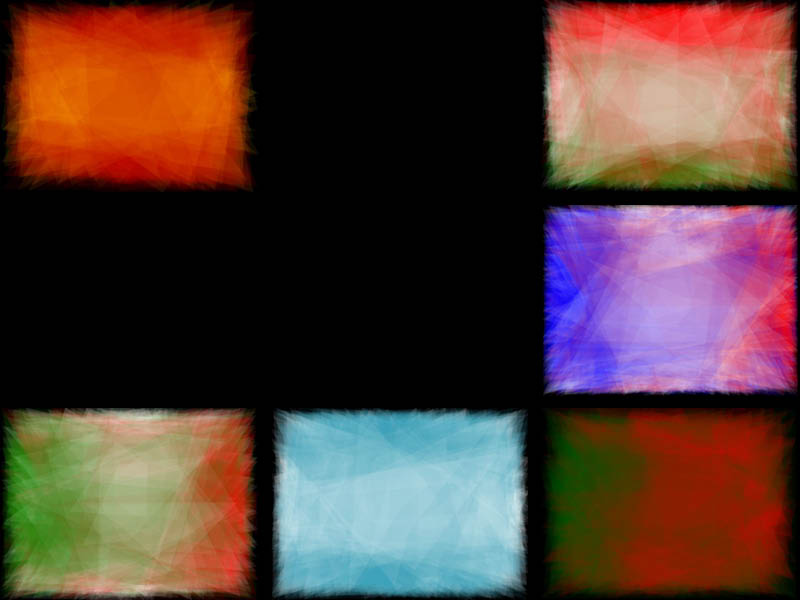
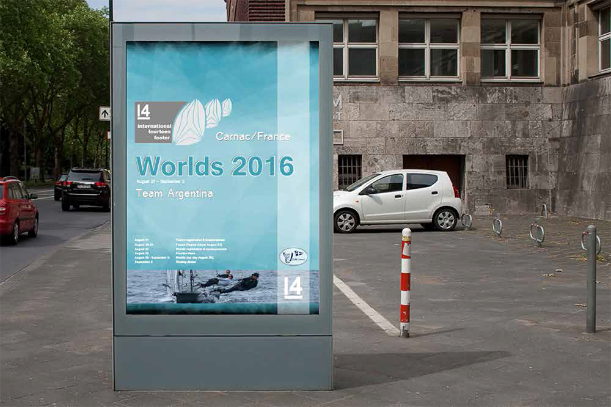

### The Mission
================

The four week project was all about working on algorithms. It was separated in three parts.

- the algorithm for humans to execute
- the traslation in material
- the translation in digital

We started off to develop an analog algorithm an try running it on at least ten person. The point was to find out how to deliver explecit tasks  to get a certain result. We ran our program for humans and tryed to improve it to make a step in direction of generative creation.
Coming from there we developed the tasks and were asked to improve the algorithm using other materialsor formats in genaral.  
Always developing the same algorithm, the last task of the project was to transfer the generative process to the computer. 

=================================
### The first algorithm

-----------------------------------
My first algorithm was very simple. The executing person had to draw a couple of circles and connect the middel points with only one line. That line must not contain any angle.

The interesting point of the results was, that all the people found very diffrent solutions for the tasks. And at this point you could tell already that there is a huge potential in creating through algerithms. The fact that the humans are executing the "program" in combination with their own intelligence was very interesting.

---------------------------------
The next step was to develop the algorithm in a way, that all the solutions look the same. Or at least, that the instructions were clear an unambiguous. 

================================

### The traslation in material

--------------------------------
To bring a new layer in the project we were asked to not only use pencil and paper to issue instruction but also involve other material, format, technique etc.

==============================

### The translation in digital

--------------------------------
For the translation in digital we worked with p5js. After a little crash course we started off to explore the possibilities in creating with code. For me it was all new and it was a challange already to install everything and get it running. But after weekend learning and following Tutorials of Peter Shifman I made littel steps. In my program are quadrangles created and stacked on top of each other. 
The quadrangles look diffrent, depending on the region on the canvas they reach with their angles. Working wit the alpha channes the were already interesting effect to observe.

-------------------------------

### The Flag Generator

To lift my program to a stage of realistic application, I adjusted it to a generator for flags. Choosing specific colors for the regions according to the original flags there is arise flags out of the dark. You can choose a stage to use them. First they appear very abstract and step by step they get closer to the original.

Organisations like world championships can use it to have their own flag design. This would be like a CI for a certain event. All the teams could have they own flag symbol but  belong together and belong to the event because of the generated flags.

click [here](http://wollemannone.github.io/flashyQuadrangle/) to see how the flag of spain is generated.

